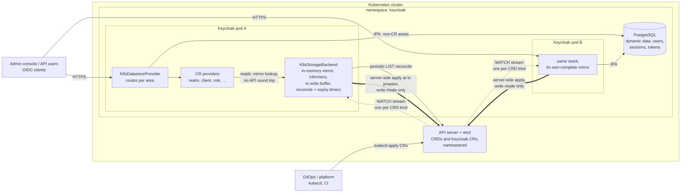
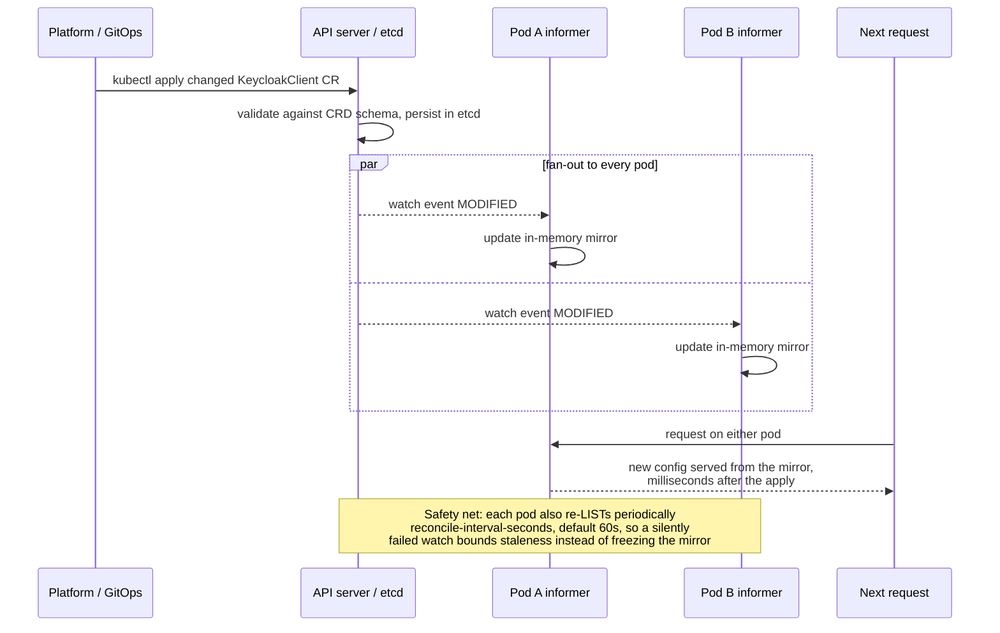
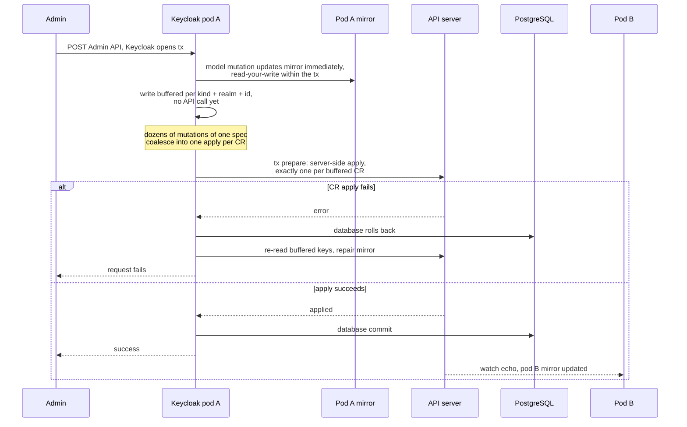

# keycloak-k8store - Architecture

Keycloak extension that stores Keycloak's **configuration-like entities** - realms, clients,
client scopes, roles, groups and identity providers - as **Kubernetes Custom Resources (CRDs)**
instead of in Keycloak's relational database, while **dynamic data** (users, credentials,
sessions, authentication sessions, action tokens, login failures) stays in the Keycloak database
by default. Three opt-in extensions of that split exist: the **`authorization` area** serves
Keycloak Authorization Services data (resource servers, resources, authorization scopes,
policies/permissions - config-class - plus UMA permission tickets, which are runtime data) from
CRs, see [Authorization Services area](#authorization-services-area-opt-in); the
**`organization` area** serves Keycloak Organizations (organization definitions - config-class
- plus invitations, which are runtime data; membership lives on the users), see
[Organizations area](#organizations-area-opt-in); and an
**experimental** `areas=all` additionally serves the dynamic areas - users (credentials
included), user sessions (client sessions embedded), auth sessions, login failures, single-use
objects and revoked tokens - from CRs; see
[Dynamic areas](#dynamic-areas-experimental) for the semantics, the credential-hash security
warning and the honest cost/consistency disclaimer.

The primary operating mode is **read-only**: CRs are authored out-of-band (GitOps, a developer
platform, an operator) and Keycloak treats them as the source of truth that cannot be modified
through the Admin API/Console. A read-write mode exists for interactive bootstrapping and tests.

Requires **Keycloak nightly** (`999.0.0-SNAPSHOT`) with the **`stateless`** feature enabled.

## How it works - at a glance

Three views of the moving parts. The sections below -
[How it plugs into Keycloak](#how-it-plugs-into-keycloak) and the
[Kubernetes backing store](#kubernetes-backing-store) - carry the full detail; these diagrams
are the map.

### Components



Arrow legend: dotted = watch streams (one `SharedIndexInformer` per CRD kind), thick = the
transaction-buffered server-side-apply write path (absent in read-only mode), solid = requests,
periodic LIST reconcile and JPA traffic. Every pod holds its **own complete mirror** of all CRs
in the namespace - reads are local map lookups and never hit the API server, and pods exchange
no config data with each other (the 2-replica deployment in `deploy/30-keycloak.yaml` relies on
nothing but the shared API server and database). Areas not served from CRs fall through to
Keycloak's default JPA providers on PostgreSQL.

### Out-of-band config change (the primary, read-only GitOps mode)



There is no invalidation protocol to get wrong: every pod observes the change independently
through its own watch, so a CR edit is live on all replicas within watch latency - no restarts,
no cache coordination.

### Admin write in write mode (transaction semantics)



The apply runs in the transaction manager's *prepare* phase, before the JPA commit: a rejected
CR write fails the request and rolls the database back. This is not two-phase commit - the
residual drift window (database commit failing *after* the CRs were applied) is described under
[Kubernetes backing store](#kubernetes-backing-store) and
[Known limitations](#known-limitations--open-risks).

## Why nightly + STATELESS

The `stateless` feature (epic [keycloak#49469](https://github.com/keycloak/keycloak/issues/49469),
named `cacheless` until its 26.7 rename -
[keycloak#50619](https://github.com/keycloak/keycloak/issues/50619)) changes the storage
landscape in exactly the way this extension needs:

* **All Infinispan distributed caches are removed** (sessions, authenticationSessions,
  actionTokens, loginFailures, …). Auth sessions, action tokens, login failures and revoked
  tokens are stored by plain JPA providers; user sessions use persistent-user-sessions (DB).
  Nodes coordinate through the database only (JGroups is restricted to JDBC_PING discovery and
  the `work` cache for best-effort invalidation).
* **The user cache is disabled** - user lookups hit the store directly.
* Keycloak instances become effectively **stateless Deployments**: no StatefulSet, no
  Infinispan cluster, no cross-node calls during request processing.

That means a Keycloak pod is left with two kinds of state: the **database** (dynamic data - we
keep it) and **config entities** (we move them to CRs served from a local, watch-synchronized
informer cache). The one cache STATELESS keeps - the local realm cache - is **disabled** by this
extension's configuration (`--spi-realm-cache--default--enabled=false`), because the informer
store *is* an always-in-sync in-memory cache: reads are map lookups, and Kubernetes watch events
keep every node's copy current within milliseconds, with no invalidation protocol of our own.

This is also the answer to multi-node consistency: **each node runs its own informers** against
the Kubernetes API. An out-of-band CR change is observed by every node independently. There is
no cross-node invalidation to get wrong - which is why the test setup insists on a 2-node kind
cluster with 2 Keycloak replicas.

## How it plugs into Keycloak

Keycloak's storage entry point is the `datastore` SPI
(`org.keycloak.storage.DatastoreProvider`, default provider `legacy` →
`DefaultDatastoreProvider`). The datastore-replacement pattern was proven by
[keycloak-extension-filestore](https://github.com/opdt/keycloak-extension-filestore)
(Apache-2.0, IT-Systemhaus der Bundesagentur für Arbeit), which inspired this design; the model
layer itself is an independent implementation on Keycloak's representation classes:

* `K8sDatastoreProviderFactory` (provider id **`k8store`**) creates a datastore provider that
  **extends `DefaultDatastoreProvider`** and overrides the accessors for the areas it replaces:
  `realms()`, `clients()`, `clientScopes()`, `roles()`, `groups()`, `identityProviders()`
  (+ `getMigrationManager()` → no-op), and - gated on the dynamic areas - `users()` (plus
  `userStorageManager()`/`userLocalStorage()`), `userSessions()`, `authSessions()`,
  `loginFailures()`, `singleUseObjects()`, `revokedTokens()`. Everything else - export/import -
  and every non-enabled area is inherited and resolves Keycloak's default providers (JPA +
  stateless JPA providers). With the `user` area enabled, `users()` resolves Keycloak's
  federation-aware `UserStorageManager` with the CR provider pinned as its local storage
  (the `userLocalStorage()` override) - **user-storage federation (LDAP/Kerberos) works with
  CR-backed users**: the manager fans lookups out to registered federation components,
  import-style providers create their shadow users in the CR store (`addUser` +
  `setFederationLink`), and the concrete `UserCredentialManager` keeps resolving local
  credentials through `userLocalStorage()`, which implements `UserCredentialStore`.
* Per-area providers (`RealmProvider`, `ClientProvider`, `ClientScopeProvider`, `RoleProvider`,
  `GroupProvider`, `IdentityProviderStorageProvider`, and for the dynamic areas
  `UserProvider`, `UserSessionProvider`, `AuthenticationSessionProvider`,
  `UserLoginFailureProvider`, `SingleUseObjectProvider`, `RevokedTokenProvider`) are registered
  under provider id
  `k8store` via `@AutoService`-generated `META-INF/services` files. All factories gate
  `isSupported()` on their area; the dynamic factories additionally register with an `order()`
  above the built-in session factories so stray `getProvider(Class)` default resolution cannot
  bypass them while enabled. Note: `isSupported()` is evaluated during Keycloak's
  *augmentation*, so with a pre-built (`--optimized`) image the `areas` option must be present
  at `kc.sh build` time; the `deploy/` manifests use a non-optimized `start` so toggling areas
  via env re-augments in the pod.
* A dummy `JpaRealmProviderFactory` (same id `jpa`, higher `order()`, `create()` → `null`)
  neutralizes Keycloak's built-in JPA realm factory, which stays registered as an event
  listener and would otherwise break on remove-events from non-JPA providers.
* The **Authorization Services store** is its own SPI (`authorizationPersister`,
  `org.keycloak.authorization.store.StoreFactory`), resolved by `AuthorizationProvider`
  directly - not through the datastore provider. `AuthzCrStoreProviderFactory` (id `k8store`,
  gated on the `authorization` area, `order()` above the built-in `jpa` store's 1) supplies
  the CR-backed `StoreFactory`; Keycloak picks the default provider of an SPI by the highest
  order, so no explicit provider pinning is needed and disabling the area transparently falls
  back to JPA. The infinispan `authorizationCache` is disabled by configuration for the same
  reason the realm cache is: the informer mirror *is* the cache, and the infinispan layer
  would not observe out-of-band CR edits.
* The **organization store** is its own SPI too (`organization`,
  `org.keycloak.organization.OrganizationProvider`, gated on the `organization` feature),
  resolved by `session.getProvider(OrganizationProvider.class)`. `OrganizationCrProviderFactory`
  (id `k8store`, gated on the `organization` area and the feature, `order()` above the built-in
  `jpa` store's 0) supplies the CR-backed provider. The built-in infinispan organization cache
  provider (id `infinispan`, order 10) hardcodes the JPA store as its delegate and depends on
  the disabled realm cache - it is disabled by configuration
  (`--spi-organization--infinispan--enabled=false`), the informer mirror is the cache.
* **Partial replacement** is the `areas` option: `config` (default, also for absent/blank) =
  the six config areas `realm,client,client-scope,role,group,identity-provider`; `all` = config
  areas plus `authorization` and `organization` plus the experimental dynamic areas
  `user,user-session,auth-session,login-failure,single-use-object,revoked-token`; or an explicit
  comma-separated list. The `authorization` and `organization` areas are config-class but
  *opt-in* (not part of the
  `config` default) so existing deployments keep their CRD set; `authorization` requires the
  `client` area
  (resource servers are keyed by their client) and the `authorization` feature (enabled by
  default upstream and no longer disabled by this extension); `organization` requires the
  `group` and `identity-provider` areas and the `organization` feature (which conversely
  requires the area when groups are CR-backed - boot validation enforces it, see the
  organizations section). Only the listed areas are served
  from CRs; the rest fall through to
  JPA. Dynamic areas never activate implicitly. Caveat: mixing config areas between CRD and JPA
  can hit referential-integrity edges in the JPA schema (e.g. group membership rows pointing at
  CRD-stored group IDs). The all-config-areas-in-CRDs split is the tested configuration; area
  subsets are covered by dedicated tests.

### Model layer (representation-based)

The CR specs *are* Keycloak's own representation classes: `RealmSpec extends
RealmRepresentation`, `ClientSpec extends ClientRepresentation`, and so on for client scopes,
roles and groups (each plus a `realm` field that scopes it). A CR body therefore reads exactly
like standard Keycloak JSON - the shape of realm exports and the Admin REST API - and the CRD
schemas are generated from the same classes. Adapter classes (`RealmAdapter`, `ClientAdapter`,
…) implement `RealmModel`, `ClientModel`, etc. directly over the specs. Identity providers and
their mappers live in the realm spec's standard `identityProviders`/`identityProviderMappers`
lists, served by a dedicated `IdentityProviderStorageProvider`.

Three deliberate properties of that design:

* **Human-readable IDs**: realm id = realm name, client id = clientId, scope id = name, realm
  role id = name, client role id = `<clientId>:<name>`. This makes CRs natural to author by
  hand/GitOps; renames are CR moves, and name-based cross-references (composites, scope
  mappings, default-scope lists, flow/config aliases) are the standard Keycloak JSON shapes.
* **Explicit persistence**: specs are plain data holders with no write-through machinery. Every
  model mutation re-persists the owning spec as a whole (server-side apply), so nested updates
  (component configs, flow executions) can never be lost between model and CR.
* **Embedded per-kind collections are not served**: a realm CR's `clients`/`roles`/`groups`/
  `users` export collections are excluded from the schema and ignored (with a warning) - the
  per-kind CRs are the storage.

### Kubernetes backing store

`k8store-core` contains the `K8sStorageBackend`:

* One **fabric8 `SharedIndexInformer` per CRD kind** (kubernetes-client 7.x with the OkHttp
  HTTP client: Keycloak ships neither OkHttp, Okio nor Kotlin, so the plain dependency jars in
  `providers/` conflict with nothing - no shading, no relocation. The Vert.x client would
  collide with Keycloak's own Vert.x, and the JDK client buffers sparse watch streams for
  minutes). A periodic list-based **mirror reconciliation** (`reconcile-interval-seconds`,
  default 60s) bounds staleness if a watch connection ever stops delivering events silently.
* Backend reads hand out **defensive copies** of the mirrored entities - request threads never
  mutate what other sessions read, and a write rejected by read-only mode or the API server
  cannot corrupt the node's mirror.
* **Write path (transaction-buffered)**: a model mutation updates the local mirror immediately
  (read-your-write within the transaction, before any watch event) but does **not** call the
  API server; the write is recorded in a per-`KeycloakSession` buffer that keeps the last state
  per `(kind, realm, id)` key (a delete after an update wins, and vice versa). The buffer is
  enlisted in Keycloak's transaction once per session:
  * on **commit** each buffered key is server-side-applied exactly once, in the transaction
    manager's *prepare* phase - i.e. before the JPA/database commit. A CR apply failure
    therefore fails the request and rolls the database back. One Keycloak operation that
    mutates the same spec dozens of times (realm creation with default flows, components and
    clients) becomes one apply per CR.
  * on **rollback** the buffer is discarded and every buffered key is re-read from the API
    server, so the optimistic mirror updates never outlive the transaction (the periodic
    reconcile loop remains the backstop if that repair read fails).
  * the remaining **drift window** is honest but small: prepare-phase apply is not two-phase
    commit. If the *database* commit fails after the CRs were applied, the CRs stay ahead of
    the rolled-back database (logged as a warning; the mirror matches the cluster). And a
    flush that fails halfway leaves the already-applied CRs in place while the database rolls
    back - same class of drift, also logged.
  * writes on threads without a resolvable session or active transaction (boot-time paths;
    informer threads never write) fall back to immediate apply-then-mirror.
* Informer caches are indexed by realm and by human-readable id; the per-area static store
  facades (`RealmCrStore`, `ClientCrStore`, …) read from these caches only - **no API-server
  round trip on the hot path**.
* Startup blocks until all informers are synced (readiness is gated on it), so a booting node
  never serves partial config.
* Specs are (de)serialized from the CR `spec` with standard Jackson bean introspection - the
  representations are proper beans - and the CRD schema generator sees exactly the same shape.
  `null` fields and `null` map values are dropped on write (a real API server rejects explicit
  nulls in `map<string,string>` schema fields), and unknown properties are ignored on read for
  rolling-upgrade tolerance.
* Namespace scoping: `namespace` option (defaults to the pod's own namespace via the
  serviceaccount namespace file, or `all-namespaces=true`).

### Read-only mode

`read-only=true` (the default) makes every mutating path throw
`org.keycloak.storage.ReadOnlyException` at the single choke point where writes funnel into the
backend (create/update/delete on the CR stores). The Admin API answers 4xx; the Admin Console
becomes a viewer for the CRD-backed areas. Users/sessions remain fully writable (they are JPA).

Bootstrap: on first start Keycloak wants to create the master realm. Either pre-provision the
generated `master` realm manifests (the build produces a baseline fixture, see below), or start
once with `read-only=false` to let Keycloak write them, then flip to read-only.

## Authorization Services area (opt-in)

The `authorization` area serves Keycloak Authorization Services (the UMA/fine-grained
entitlement engine behind `authorizationServicesEnabled` clients) from five CR kinds. It is
config-class - the primary read-only GitOps pattern applies - but **opt-in**: it joins
`areas=all` and explicit lists, never the `config` default, so enabling it is a deliberate step
that comes with five new CRDs. It requires the `client` area, because resource servers are
keyed by their client.

* **Identity**: the resource-server id is the owning client's clientId (this store's client id
  - one `KeycloakResourceServer` CR per authz-enabled client). Resources, authorization scopes,
  policies and permission tickets keep upstream's generated-UUID ids: their names are only
  unique per resource server (resources even only per owner), so a human-readable id would need
  a composite key for no authoring benefit - these CRs are usually Keycloak-managed.
* **Cross-references are id sets in the specs** (`AuthzResourceSpec.scopeIds`,
  `AuthzPolicySpec.resourceIds/scopeIds/associatedPolicyIds`) - the JPA junction tables in CR
  shape, plain strings, so the CRD schemas stay free of the representation classes'
  resource↔scope recursion. Type-specific policy settings (a role policy's roles, a client
  policy's clients) live in `AuthzPolicySpec.config` exactly as Keycloak's policy providers
  store them (JSON-array strings); upstream's `RepresentationToModel`/policy providers own that
  format, the store only persists it.
* **Semantics mirror the upstream JPA store**: name uniqueness per resource server is enforced
  at create time (`ModelDuplicateException` - there is no database constraint to fall back on),
  the search filters keep JPA's SQL-LIKE contains semantics (`*` wildcards, case-insensitive
  for names/types, case-sensitive for config values), scope-driven policy lookups are
  restricted to `type == "scope"` permissions, the generic policy search keeps the implicit
  owner-is-null filter, and `findDependentPolicies` - including the fine-grained-admin variant
  that matches scope names, `defaultResourceType` config and associated-policy config values -
  is an in-memory filter over the realm's policy mirror. Cascades that upstream implements
  *above* the store (resource delete → tickets + single-resource permissions; scope delete →
  tickets; policy delete → detach from dependent policies) run unchanged through
  `AuthorizationProvider`'s store wrappers; client removal deletes the client's whole
  authorization graph (k8store `CLIENT_BEFORE_REMOVE`, mirroring JPA's resource-server delete
  cascade), realm removal bulk-deletes every authorization CR, and the SPI's standard
  synchronization listeners stay registered for user-removal cleanup (tickets, user-owned
  resources) and client-policy purging.
* **Writability split**: resource servers, resources, scopes and policies are configuration -
  read-only mode rejects their writes (the Admin API answers 4xx). **Permission tickets are
  runtime data** (UMA permission requests/grants created by the protection API and the account
  console's "my resources" flows) and stay writable in read-only mode, exactly like the dynamic
  kinds.
* **Fine-grained admin permissions v2** (`admin-permissions` feature, preview) writes policies
  at *runtime* whenever an admin manages permissions - with read-only mode those writes are
  rejected, so **FGAP v2 requires write mode**. The feature stays disabled in the default test
  configuration; the `authorization` feature itself is enabled everywhere (upstream default).
* **Realm scoping**: Keycloak's authorization SPI is realm-blind (upstream ids are globally
  unique UUIDs), this store keys every CR by realm. Store lookups resolve the realm from the
  model instance where one is passed, else from the session context; id-only lookups fall back
  to a cross-realm mirror scan - unambiguous for the UUID-keyed kinds, context-realm-first for
  resource servers (clientIds are only unique per realm).

## Organizations area (opt-in)

The `organization` area serves Keycloak Organizations from two CR kinds. It is config-class -
the read-only GitOps pattern applies to the organization definitions - but **opt-in**: it joins
`areas=all` and explicit lists, never the `config` default. It requires the `group` area (each
organization is backed by a group, membership is group membership, organization-scoped
subgroups are groups) and the `identity-provider` area (the broker linkage lives on the
identity providers in the realm CR).

The storage split mirrors Keycloak's own model, where the organization entity holds only the
definition and everything else lives on other kinds:

* **`KeycloakOrganization`** (spec extends `OrganizationRepresentation` + realm + backing-group
  reference): name, alias (immutable once set), enabled, description, redirect URL, email
  domains (name + verified) and attributes. The representation's embedded `members`, `groups`
  and `identityProviders` collections are excluded from the schema and ignored with a warning
  if authored - their content lives elsewhere. Deviation from upstream JPA: attributes are
  stored in the organization spec, not on the backing group (the representation carries them
  and the CR is the authored artifact).
* **Backing group**: created through `session.groups()` - so it lands in the group area as a
  `KeycloakGroup` CR - with the upstream conventions: group name = organization id, `spec.type:
  organization`, plus `spec.organizationId` (the CR shape of upstream's group-to-organization
  column and foreign key). Organization-scoped subgroups are group CRs of the same type. The
  regular group surface (name lookups, searches, counts, top-level lists) filters organization
  groups out, exactly like upstream JPA's `type = REALM` predicates; id-based lookups stay
  type-blind. Upstream's group-event guard (registered by the built-in JPA organization
  factory) keeps rejecting organization-group mutations outside an organization context.
* **Membership is group membership of the backing group** and lives on the **user side** -
  database rows (`USER_GROUP_MEMBERSHIP`) by default, `KeycloakUser` CRs with the `user` area.
  Upstream stores the MANAGED/UNMANAGED membership type in a membership column that no model
  API can read back; this store marks MANAGED members (lifecycle bound to the organization -
  removal from the organization deletes the user; typically broker-provisioned) with the
  multi-valued user attribute `k8store.org.managed` holding the organization ids. With
  Keycloak's default unmanaged-attribute policy the attribute is invisible to and preserved
  through user-profile updates.
* **Identity-provider linkage** is the `organizationId` field of the identity provider entry
  in the realm CR - where the model keeps it; `getByOrganization` resolves through the
  standard identity-provider query options.
* **`KeycloakOrganizationInvitation`**: one CR per pending/expired invitation (email, names,
  created/expiry epoch seconds, invite link). Runtime data - always writable, like permission
  tickets. Expired invitations are kept and stay listable via the status filter (upstream
  parity); they are removed by acceptance, revocation, organization removal or realm removal,
  never by the expiry reaper.

**Writability split**: organization definitions (organization CR, backing/organization group
CRs, the IdP linkage in the realm CR) are configuration - read-only mode rejects their writes;
a GitOps author provides the `KeycloakOrganization` CR together with its backing
`KeycloakGroup` (`type: organization`, id/name = organization id) and sets `organizationId` on
the realm CR's identity providers. Organization **membership** (invitation acceptance,
registration, broker-driven managed joins) mutates only user-side state, and invitations are
always-writable - both keep working in read-only mode.

**Feature coupling (boot-validated)**: the `organization` feature is enabled by default
upstream but force-disabled by this extension's default configuration, because with groups
served from CRs the built-in JPA organization store cannot work - its create path resolves the
backing group as a JPA row (`em.find(GroupEntity)`) and NPEs on CR-backed groups the moment an
organization is created. `K8sStoreConfig` therefore rejects the combination
`organization`-feature-on + `group`-area-on + `organization`-area-off at boot with a clear
error: enable the feature together with the area (plus
`--spi-organization--infinispan--enabled=false`, see above), or keep it disabled.

## Dynamic areas (EXPERIMENTAL)

With `areas=all` (or an explicit list) the volatile storage areas are served from CRs of their
own kinds. **This is experimental and not the supported production pattern** - that remains
config-in-CRs + dynamic-in-DB (the default). The honest cost/consistency picture:

* **Every login, token refresh and flow step becomes CR writes.** Session CRs are etcd objects:
  API-server throughput and etcd churn/object-size limits now bound the login rate.
* CR writes are transaction-buffered (the dozens of setter calls of one request coalesce into
  one server-side apply per CR at the prepare phase) but **still not atomic with the
  database** - the same drift window as the config kinds applies, now on every login.
* The informer mirror is eventually consistent across nodes (watch latency, milliseconds).

Semantics, per area:

* **Users** (`KeycloakUser`): one CR per user - Keycloak's `UserRepresentation` plus the realm,
  with role grants (by name), group membership (by group id), consents (granted scope names
  plus, with the experimental `parameterized-scopes` feature, the per-scope parameters in
  `grantedScopeParameters`), federated identity links, required actions and the **stored
  credentials** (`spec.credentials`:
  id/type/userLabel/createdDate + the hashed `secretData`/`credentialData` JSON; list order =
  priority order). Identity: user id = lowercased username at creation, **immutable** - unlike
  the other kinds a username rename does not move the CR, so token `sub` claims, session CRs
  and login-failure CRs stay valid. Usernames/emails are normalized to lower case on write
  (upstream JPA does the same), making all lookups case-insensitive; the realm attribute
  `keycloak.username-search.case-sensitive` is not honored. Credential handling is Keycloak's
  own: the provider implements the `UserCredentialStore` interface and hands out the standard
  `UserCredentialManager`, so hashing (`PasswordHashProvider`), validation fan-out and policy
  enforcement are upstream code - the store only persists the hashed credential models.
  **Security: user CRs carry credential hashes** (and broker tokens in
  `spec.federatedIdentityTokens` when identity-provider token storage is on) - restrict RBAC
  read access to `keycloakusers` to Keycloak's service account. The CRD schema excludes the
  representation's plaintext `value` credential field, so a real API server prunes hand-authored
  plaintext at admission. User-storage federation (LDAP/Kerberos) is supported: the
  datastore routes `users()` through `UserStorageManager`, imported federated users are user
  CRs with `spec.federationLink`, and the unlink/remove-imported admin operations work against
  the CR store. **OID4VC verifiable credentials** (experimental `oid4vc-vci` feature) are
  stored in two dedicated kinds - `KeycloakUserVerifiableCredential` (per-user credential
  registrations incl. the profile-attribute snapshot upstream stores too) and
  `KeycloakIssuedVerifiableCredential` (issuance events with `expiresAt`) - registered only
  when the feature is enabled together with the area, with upstream JPA semantics (generated
  ids, revision rolling on update, update/removal addressed by client-scope id, issuances
  inherit the credential's revision and die with it, client/scope/user/realm removal cascades).
  Expiry deviation: reads filter expired issuances and the store's reaper deletes them -
  upstream's scheduled cleanup task is not registered under this datastore, the reaper is its
  replacement.
* **User sessions** (`KeycloakUserSession`): one CR per session, client sessions embedded in a
  map keyed by client storage id - a login is one CR write. Offline sessions are separate CRs
  (`offline: true`) linked bidirectionally to their online origin through the
  `correspondingSessionId` note (lookups by the online id follow the note). TRANSIENT sessions
  (e.g. service-account logins with transient sessions) live in provider memory and never touch
  storage. Expiration (`expiresAt`, epoch millis) is recomputed from the realm's and client's
  timeout settings (via Keycloak's `SessionExpirationUtils`) whenever a timestamp moves.
* **Auth sessions** (`KeycloakAuthSession`): one CR per root authentication session with all
  browser tabs embedded (per-root tab limit 300, oldest evicted); creating/removing a tab
  refreshes the root's timestamp and expiration.
* **Login failures** (`KeycloakLoginFailure`): one CR per (realm, user), user id = store id; no
  expiration, deleted by `clearFailures`/realm removal.
* **Single-use objects** (`KeycloakSingleUseObject`): not transaction-buffered - action tokens
  and replay guards must be visible (on every node) the moment the call returns. The single-use
  contract maps directly onto Kubernetes primitives: `remove` = DELETE (answered exactly once
  across all nodes), `putIfAbsent` = atomic create (409 for the losers). Reads on the
  single-use paths fall back to a direct API-server GET on a mirror miss.
* **Revoked tokens** (`KeycloakRevokedToken`): insert-if-absent with expiry = token lifetime;
  `contains` reads the mirror only (it runs on every token validation - a revocation from
  another node holds within watch latency).

**Expiry is the store's job**: every read filters entities whose `expiresAt` passed, and a
background reaper (same scheduler as the mirror reconciliation, `expiration-sweep-seconds`,
default 300) deletes expired CRs of the dynamic kinds. Keycloak's `removeAllExpired` hooks are
no-ops.

**Per-kind writability**: the dynamic kinds are always writable, including in `read-only=true`
mode - read-only guards the config kinds only. Read-only + dynamic areas is a legitimate
combination: config CRs immutable (GitOps), session CRs fully Keycloak-managed.

**Gated registration**: informers (and the startup sync wait) for the dynamic kinds only exist
when their area is enabled. A deployment on the default areas boots with zero new watches and
does not need the dynamic CRDs installed.

## CRDs

API group **`k8store.dominikschlosser.github.io`**, version **`v1alpha1`**, namespaced:

| Kind | Plural | Spec | Scope of one CR |
|---|---|---|---|
| `KeycloakRealm` | `keycloakrealms` | `RealmSpec` | one realm (incl. flows, components, embedded IdPs) |
| `KeycloakClient` | `keycloakclients` | `ClientSpec` | one client |
| `KeycloakClientScope` | `keycloakclientscopes` | `ClientScopeSpec` | one client scope |
| `KeycloakRole` | `keycloakroles` | `RoleSpec` | one realm or client role |
| `KeycloakGroup` | `keycloakgroups` | `GroupSpec` | one group |
| `KeycloakResourceServer` (krs) | `keycloakresourceservers` | `ResourceServerSpec` | the Authorization Services settings of one client - `authorization` area |
| `KeycloakAuthzResource` (kazr) | `keycloakauthzresources` | `AuthzResourceSpec` | one protected resource of a resource server - `authorization` area |
| `KeycloakAuthzScope` (kazs) | `keycloakauthzscopes` | `AuthzScopeSpec` | one authorization scope of a resource server - `authorization` area |
| `KeycloakAuthzPolicy` (kazp) | `keycloakauthzpolicies` | `AuthzPolicySpec` | one policy or permission of a resource server (references by id sets + policy config) - `authorization` area |
| `KeycloakPermissionTicket` (kpt) | `keycloakpermissiontickets` | `PermissionTicketSpec` | one UMA permission request/grant - `authorization` area, runtime data (writable in read-only mode) |
| `KeycloakOrganization` (korg) | `keycloakorganizations` | `OrganizationSpec` | one organization definition (domains, attributes; backing group is a `KeycloakGroup` with `type: organization`) - `organization` area |
| `KeycloakOrganizationInvitation` (korginv) | `keycloakorganizationinvitations` | `OrganizationInvitationSpec` | one organization invitation - `organization` area, runtime data (writable in read-only mode) |
| `KeycloakUser` (ku) | `keycloakusers` | `UserSpec` | one user (credentials hashed, grants/membership/consents embedded) - dynamic, experimental, **contains credential hashes: restrict RBAC** |
| `KeycloakUserVerifiableCredential` (kuvc) | `keycloakuserverifiablecredentials` | `UserVerifiableCredentialSpec` | one OID4VC verifiable credential of a user - `user` area + `oid4vc-vci` feature, experimental |
| `KeycloakIssuedVerifiableCredential` (kivc) | `keycloakissuedverifiablecredentials` | `IssuedVerifiableCredentialSpec` | one OID4VC issuance event (expiring) - `user` area + `oid4vc-vci` feature, experimental |
| `KeycloakUserSession` (kus) | `keycloakusersessions` | `UserSessionSpec` | one user session, online or offline (client sessions embedded) - dynamic, experimental |
| `KeycloakAuthSession` (kas) | `keycloakauthsessions` | `AuthSessionSpec` | one root authentication session (browser tabs embedded) - dynamic, experimental |
| `KeycloakLoginFailure` (klf) | `keycloakloginfailures` | `LoginFailureSpec` | brute-force counters of one (realm, user) - dynamic, experimental |
| `KeycloakSingleUseObject` (ksuo) | `keycloaksingleuseobjects` | `SingleUseObjectSpec` | one action token/nonce/replay guard - dynamic, experimental |
| `KeycloakRevokedToken` (krt) | `keycloakrevokedtokens` | `RevokedTokenSpec` | one revoked token id - dynamic, experimental |

CRs carry a `k8store.keycloak.io/realm` label (set by the tooling, required for authored CRs)
for informer indexing, and the entity's realm reference lives in the spec itself. The
authorization, organization and dynamic
kinds' CRDs are only required (and only watched) when their areas are enabled; the dynamic
kinds' CRs (and invitations) are
volatile Keycloak-managed state, never authored by hand. Single-use objects and revoked tokens
have no realm scope and are indexed under the `@global` pseudo-realm.

### Auto-generation ("from the storage model directly")

CRDs are **generated at build time from the entity classes** with the fabric8
`crd-generator-maven-plugin` (v2, Jackson-based - the same mechanism the upstream
keycloak-operator uses to generate the `KeycloakRealmImport` CRD from `RealmRepresentation`).
Generating from the storage model rather than from the Admin REST representations was a
deliberate choice: the entities are flat (no `GroupRepresentation.subGroups`-style recursion),
smaller per-kind (no 174 KB realm-import mega-schema), and 1:1 with what the providers serve, so
there is no lossy representation→model conversion at read time. The generated schemas are
checked into `crds/` and a build-time check fails when the generated output drifts from the
committed files.

### Keycloak upgrades & CRD evolution

Upgrading the `keycloak.version` property regenerates the CRDs from the new entity model. The
`k8store-crd-tools` module provides a CLI (also wrapped as `scripts/crd-tools.sh`) that:

1. **diffs** two CRD generations (committed vs freshly generated, or in-cluster vs built) on the
   `openAPIV3Schema` level and classifies changes: *compatible* (added optional fields, added
   enum values, description changes) vs **breaking** (removed/retyped fields, new required
   fields);
2. fails CI on breaking changes unless the CRD **version is bumped** (`v1alpha1` → `v1alpha2`
   served alongside, conversion strategy `None` for field-compatible versions);
3. **applies** CRD updates with server-side apply (`kubectl apply --server-side` semantics -
   also avoids the 262144-byte `last-applied-configuration` annotation limit that large
   Keycloak-derived CRDs are known to hit).

Rolling out a compatible CRD update to a running cluster is non-disruptive: existing CRs are
untouched (schemas validate on write, not retroactively), informers keep running, and Keycloak
pods roll normally. For version bumps the standard Kubernetes sequence applies (add new served
version → migrate CRs → flip storage version → retire old version); the CLI prints the plan.

## Testing strategy

Test coverage uses the **official Keycloak test framework**
(`org.keycloak.testframework`, version-locked to Keycloak nightly) at three levels:

1. **Embedded integration tests** (`tests/` module, default `KC_TEST_SERVER=embedded`):
   Keycloak runs in the test JVM with the extension deployed from the local Maven repository,
   `--features=stateless`, `--spi-datastore--provider=k8store`. The Kubernetes API is a **real
   kind cluster** (context `kind-k8store`, created by `scripts/kind-up.sh`) - no mocks: real
   schema validation, real server-side apply, real watches. Each JVM run works in an ephemeral
   `k8store-test-*` namespace and applies the committed CRDs. Covers: provider parity per
   entity type (realm/client/scope/role/group/IdP through the Admin REST API), read-only
   enforcement, write-mode round-trips, area subsets, the authorization area (resource-server
   graph CRs with cross-references, UMA entitlement evaluation end to end, deletion cascades),
   the organization area (organization CR + backing group CR materialization, membership from
   both ends, IdP linkage in the realm CR, search, deletion cascade),
   the dynamic areas (users, sessions, …),
   and CR authority (out-of-band CR edits drive admin reads; JPA config tables stay empty -
   asserted inside the server via run-on-server). The `areas=all` server runs in its **own**
   ephemeral namespace (`TestKube.dynamicNamespace()`): the embedded servers of one JVM share
   the dev database, and the config-mode servers rely on the bootstrap admin surviving there -
   a users-as-CRs server bootstraps its admin into CRs instead, so the two storage modes get
   independent master-realm bootstraps.
2. **Restart-with-different-config sequencing**: the mock cluster (and the in-JVM H2 database)
   outlive embedded-server restarts, so ordered test classes cover the real operational flow -
   boot in write mode (Keycloak bootstraps the master realm into CRs), restart the server
   read-only against those same CRs, verify enforcement and out-of-band change propagation.
   A `DefaultRealmBaselineTest`-style content-drift baseline (snapshot the master-realm CRs and
   diff on Keycloak version bumps) is the planned complement to the CRD *schema* diff.
3. **kind e2e** (`KC_TEST_SERVER=remote`): the same test suite plus cluster-specific tests runs
   against Keycloak deployed on a **2-node kind cluster** (2 Keycloak replicas, PostgreSQL,
   CRDs + fixture CRs applied). Two nodes are non-negotiable: they surface informer/consistency
   bugs (e.g. a CR edit must be visible on both replicas) that a single node hides. The remote
   server is reached via `kubectl port-forward` (the framework's remote mode is fixed to
   `localhost:8080`/`9000`), with bootstrap admin credentials matching the framework's
   expectations. Cluster tests assert cross-replica visibility of out-of-band CR changes by
   pinning requests to each pod.

## Repository layout

```
crds/                      committed, generated CRD manifests (CI fails on drift)
deploy/                    Kubernetes manifests: keycloak, postgres, RBAC + Dockerfile
core/                      provider jar: entities + CR classes (CRD generation), adapters,
                           providers, Kubernetes backend, datastore provider
crd-tools/                 CRD schema diff / check-cluster / server-side-apply CLI
tests/                     test-framework integration tests (embedded + remote)
scripts/kind-up.sh         create 2-worker kind cluster + local registry
scripts/deploy.sh          build extension → image → load into kind → apply manifests
scripts/kind-down.sh       tear down
scripts/update-crds.sh     regenerate crds/ after a Keycloak version bump
scripts/crd-tools.sh        CRD schema diff (wraps crd-tools)
scripts/e2e.sh             port-forward + run test suite in remote mode
```

## Configuration reference (Keycloak server options)

```
--features=stateless                                  # required (nightly; becomes 'stateless' in 26.7)
                                                      # optional experimental features served by the
                                                      # user area: oid4vc-vci (adds two CR kinds),
                                                      # parameterized-scopes (consent parameters)
--spi-datastore--provider=k8store                     # activate this datastore
--spi-datastore--k8store--read-only=true              # default: true (config kinds; dynamic kinds stay writable)
--spi-datastore--k8store--areas=config                # default: the config areas; 'all' adds the
                                                      # authorization area and the experimental
                                                      # dynamic areas; or an explicit list
--spi-datastore--k8store--namespace=<ns>              # default: own pod namespace
--spi-datastore--k8store--all-namespaces=false
--spi-datastore--k8store--expiration-sweep-seconds=300  # reaper for expired dynamic CRs (0 = off)
--spi-realm--jpa--enabled=false                       # disable built-in JPA realm provider
--spi-realm-cache--default--enabled=false             # informer cache replaces realm cache
--spi-authorization-cache--default--enabled=false     # informer cache replaces authz cache
--features-disabled=organizations                     # not supported by this model layer
```

## Known limitations / open risks

* Organizations require the opt-in `organization` area; with the default areas the
  `organization` feature stays disabled (boot-validated: the built-in JPA organization store
  cannot reference CR-backed groups). Invitation emails need SMTP as usual; expired invitations
  are kept (listable via the status filter), upstream parity. The MANAGED-member marker is a
  user attribute (`k8store.org.managed`) - with a permissive unmanaged-attribute policy an
  admin could edit it.
* Fine-grained admin permissions v2 (`admin-permissions`, preview) writes policies at runtime -
  it requires write mode; with read-only mode its permission writes answer 4xx.
* Admin/auth **events** for CRD-backed areas follow the default event store; the extension does
  not replace it.
* In write mode there is no cross-node write coordination beyond Kubernetes optimistic
  concurrency (`resourceVersion` conflicts surface as errors); read-only mode is the
  recommended production pattern.
* CR writes are transaction-buffered and applied in the prepare phase, before the database
  commit - a rejected CR write rolls the database back - but there is no two-phase commit
  across the API server and the database: a database commit failure after the CRs were
  applied, or a flush failing halfway, leaves the applied CRs ahead of the rolled-back
  database (logged loudly; another reason read-only is the production pattern).
* **Model migrations are skipped** when realms are CR-backed (`CrMigrationManager` is a
  no-op). Background: on version upgrades Keycloak normally runs two mechanisms - Liquibase
  *schema* migrations (still run, for whatever lives in the database) and `MigrateTo*` *model*
  migrations, boot-time rewrites of stored config content (e.g. Keycloak 25 created the new
  built-in `basic` client scope in every realm and attached it to clients). The model
  migrations are skipped here on purpose: they are imperative store rewrites, which conflicts
  with a declaratively owned GitOps store - a hidden boot-time write would be reverted by the
  next `kubectl apply`, is forbidden in read-only mode, and would race across replicas during
  rolling upgrades. Note the no-op skips *all* `MigrateTo*` steps, including the rare ones
  that touch database-stored data. Operational playbook on version bumps: read the upstream
  migration guide and express applicable config changes in the CR manifests (shortcut:
  bootstrap the new version in write mode in a scratch namespace and diff its CRs against
  yours); the version-stamp label + boot warning flag CRs written by an older version; the
  CRD schema diff (`scripts/crd-tools.sh`) covers the *shape* side. Content-level migration
  tooling (a diff-and-patch helper for manifests) is future work.
* JPA referential integrity when mixing stores (e.g. `USER_GROUP_MEMBERSHIP` → CRD group ids)
  is verified by tests; if the schema enforces FKs for a mapping table, that mapping area must
  live on the same side as its target.
* The **dynamic areas are experimental** (see above): every login becomes CR writes with etcd
  churn and API-server throughput as the bounding resources, CR writes are not atomic with the
  database, and cross-node visibility is watch latency (milliseconds). Not implemented for
  them: per-session note-based lifespan overrides (`internal.maxLifespanOverride` …),
  `importUserSessions` (session import/export), and the auth-session tab limit is a constant
  (300) rather than an option.
* With the **`user` area** enabled: user CRs carry credential hashes (restrict RBAC, see
  above), and the realm's `keycloak.username-search.case-sensitive` attribute is not honored
  (usernames/emails are normalized to lower case, upstream-JPA style). User-storage federation
  (LDAP/Kerberos), OID4VC verifiable-credential storage (experimental upstream feature; two
  extra CRDs, only needed with the feature on) and consent scope-parameters of the
  experimental `parameterized-scopes` feature (persisted per scope in the consent entries,
  `grantedScopeParameters`) are supported.
* **Toggling the `user` area on existing data is a migration event**: enabling it hides every
  database-stored user (including the bootstrap admin), disabling it hides the user CRs. No
  automatic migration exists - enable it on a fresh bootstrap or migrate users first.
* The `stateless` → `stateless` rename in 26.7 will require touching one constant and the
  documented flags (isolated in `K8sDatastoreProviderFactory` and the deploy manifests).
