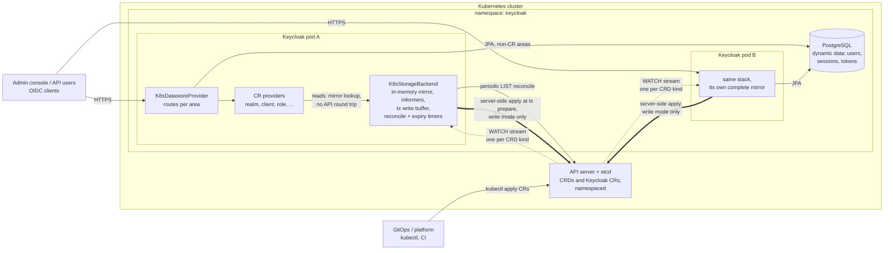
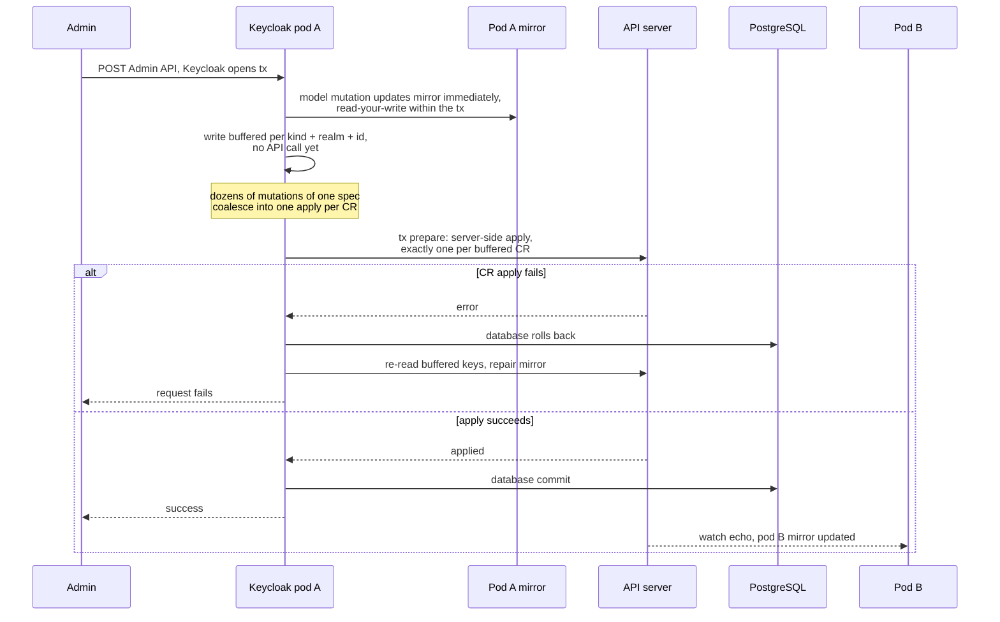

# keycloak-k8store - Architecture

Stores Keycloak's **configuration entities** (realms, clients, client scopes, roles, groups,
identity providers) as **Kubernetes Custom Resources** instead of in the database, while
**dynamic data** (users, sessions, tokens) stays in the database. The primary mode is
**read-only**: CRs are authored out-of-band (GitOps) and Keycloak cannot change them. A
read-write mode exists for bootstrapping and tests. Opt-in areas extend the split to
Authorization Services, Organizations, and - experimentally - every remaining area including
users and sessions.

Requires **Keycloak nightly** (`999.0.0-SNAPSHOT`) with the **`stateless`** feature.

## How it works - at a glance

### Components



Dotted = watch streams (one `SharedIndexInformer` per CRD kind), thick = the
transaction-buffered write path (write mode only), solid = requests, reconcile and JPA. Every
pod holds its **own complete mirror** of all CRs in the namespace: reads are local map lookups,
and pods exchange no config data - they share only the API server and database.

### Out-of-band config change (the read-only GitOps path)

```mermaid
sequenceDiagram
    participant P as Platform / GitOps
    participant K as API server / etcd
    participant A as Pod A informer
    participant B as Pod B informer
    participant R as Next request

    P->>K: kubectl apply changed KeycloakClient CR
    K->>K: validate against CRD schema, persist in etcd
    par fan-out to every pod
        K-->>A: watch event MODIFIED
        A->>A: update in-memory mirror
    and
        K-->>B: watch event MODIFIED
        B->>B: update in-memory mirror
    end
    R->>A: request on either pod
    A-->>R: new config served from the mirror,<br/>milliseconds after the apply
    Note over K,B: Safety net: each pod also re-LISTs periodically<br/>(reconcile-interval-seconds, default 60s), so a<br/>silently failed watch bounds staleness
```



Every pod observes the change through its own watch - no invalidation protocol, no cache
coordination, no restarts.

### Admin write in write mode (transaction semantics)



The apply runs in the transaction manager's *prepare* phase, before the JPA commit, so a
rejected CR write fails the request and rolls the database back. It is not two-phase commit -
see the drift window in [Known limitations](#known-limitations).

## Why nightly + stateless

The `stateless` feature ([keycloak#49469](https://github.com/keycloak/keycloak/issues/49469),
named `cacheless` before its 26.7 rename) removes all Infinispan distributed caches: sessions,
auth sessions, action tokens, login failures and revoked tokens move to plain JPA providers,
user sessions to persistent-user-sessions, and the user cache is disabled. Keycloak instances
become effectively **stateless Deployments** - no StatefulSet, no Infinispan cluster, no
cross-node calls during requests; nodes coordinate only through the database.

That leaves a pod with two kinds of state: the **database** (dynamic data, kept) and **config
entities** (moved to CRs, served from a watch-synchronized informer mirror). The one cache
`stateless` keeps - the local realm cache - is disabled here
(`--spi-realm-cache--default--enabled=false`), because the mirror already *is* an always-in-sync
in-memory cache. Each node runs its own informers, so an out-of-band CR change reaches every
node independently with no invalidation to get wrong - which is why the tests insist on a 2-node
cluster.

## How it plugs into Keycloak

Keycloak's storage entry point is the `datastore` SPI (default provider `legacy` ->
`DefaultDatastoreProvider`). The datastore-replacement pattern was inspired by
[keycloak-extension-filestore](https://github.com/opdt/keycloak-extension-filestore) (Apache-2.0);
the model layer here is an independent implementation on Keycloak's representation classes.

* **`K8sDatastoreProviderFactory`** (provider id `k8store`) creates a provider that extends
  `DefaultDatastoreProvider` and overrides the accessors for the enabled areas
  (`realms()`, `clients()`, ..., plus the dynamic `users()`/`userSessions()`/... when enabled),
  inheriting everything else. With the `user` area on, `users()` resolves Keycloak's
  federation-aware `UserStorageManager` with the CR provider pinned as `userLocalStorage()`, so
  **LDAP/Kerberos federation works with CR-backed users** (the CR provider implements
  `UserCredentialStore`, credentials go through the standard `UserCredentialManager`).
* **Per-area providers** are `@AutoService`-registered under id `k8store` and gate `isSupported()`
  on their area. `isSupported()` is evaluated at Keycloak *augmentation*, so with a pre-built
  (`--optimized`) image the `areas` option must be set at `kc.sh build` time; the `deploy/`
  manifests use a non-optimized `start` so env changes re-augment in the pod.
* A dummy `JpaRealmProviderFactory` (same id `jpa`, higher `order()`, `create()` -> `null`)
  neutralizes Keycloak's built-in JPA realm factory, which otherwise breaks on remove-events
  from non-JPA providers.
* **Authorization** and **organizations** are separate SPIs (`authorizationPersister`,
  `organization`), resolved by highest `order()`; the CR-backed factories outrank the built-in
  `jpa` stores when their area is enabled and fall back to JPA otherwise. Their Infinispan caches
  are disabled by config for the same reason as the realm cache.

**`areas` option**: `config` (default) = the six config areas; `all` = config areas plus
`authorization`, `organization`, and the experimental dynamic areas
(`user,user-session,auth-session,login-failure,single-use-object,revoked-token`); or an explicit
comma list. `authorization`/`organization` are config-class but opt-in (not in `config`, so
existing deployments keep their CRD set). Mixing config areas between CRD and JPA can hit JPA
referential-integrity edges (e.g. group-membership rows pointing at CRD group ids); the tested
configuration is all-config-in-CRDs.

## Model layer

The CR specs *are* Keycloak's representation classes: `RealmSpec extends RealmRepresentation`,
`ClientSpec extends ClientRepresentation`, and so on (each plus a `realm` field). A CR body reads
like standard Keycloak JSON, and the CRD schemas generate from the same classes. Adapters
(`RealmAdapter`, ...) implement `RealmModel` etc. directly over the specs; identity providers
live in the realm spec's standard lists.

Three deliberate properties:

* **Human-readable ids**: realm id = name, client id = clientId, scope id = name, realm role id
  = name, client role id = `<clientId>:<name>`. Renames are CR moves that cascade to the
  name-keyed cross-references (composites, grants, scope mappings, default-scope lists, and the
  authorization role-policy configs) and reject a target name already in use.
* **Explicit persistence**: specs are plain data holders; every model mutation re-persists the
  whole owning spec, so nested updates (component configs, flow executions) are never lost.
* **Embedded per-kind collections are not served**: a realm CR's `clients`/`roles`/`groups`/
  `users` export collections are excluded from the schema and ignored on read - the per-kind CRs
  are the storage.

## Kubernetes backing store

`K8sStorageBackend` runs one **fabric8 `SharedIndexInformer` per CRD kind** (kubernetes-client
7.x, OkHttp client - Keycloak ships no OkHttp/Okio/Kotlin so the plain dependency jars conflict
with nothing; the Vert.x client would clash with Keycloak's, the JDK client buffers sparse watch
streams for minutes). Key properties:

* **Reads** are served from the mirror (no API round trip) and hand out **defensive copies**, so
  a request thread can never corrupt what other sessions read, and a rejected write cannot poison
  the mirror.
* **Writes** update the mirror immediately (read-your-write) and buffer the API call per
  `KeycloakSession`, keyed by `(kind, realm, id)` with last-write-wins. On **commit** each key is
  server-side-applied once in the *prepare* phase (before the DB commit), so a CR failure fails
  the request and rolls the DB back; one operation that mutates a spec dozens of times becomes
  one apply per CR. On **rollback** the buffer is discarded and affected keys re-read from the
  server. Boot-time writes without a session fall back to immediate apply.
* **Startup** blocks until all informers sync (readiness gated on it), so a booting node never
  serves partial config. A periodic list-based **reconcile** (`reconcile-interval-seconds`,
  default 60s) bounds staleness if a watch silently stops delivering.
* **Serialization** is standard Jackson bean introspection; `null` fields and `null` map values
  are dropped on write (a real API server rejects explicit nulls in `map<string,string>` schema
  fields), and unknown properties are ignored on read for rolling-upgrade tolerance.
* Single-use objects and revoked tokens are indexed under the `@global` pseudo-realm and bypass
  the buffer: `putIfAbsent` is an atomic create (409 loses; an expired CR is reclaimed under its
  `resourceVersion`), `remove` is a DELETE answered exactly once across nodes.

**Read-only mode** (`read-only=true`, default) throws `ReadOnlyException` at the single write
choke point for the config kinds; the Admin API answers 4xx. Dynamic kinds stay writable. On an
empty store, either pre-provision the master realm manifests or boot once with `read-only=false`
to let Keycloak write them, then flip.

## Opt-in areas

### Authorization Services

Five CR kinds serve the UMA/fine-grained entitlement engine, gated on the `authorization` area
(requires `client`; resource servers are keyed by their clientId). Resources, scopes, policies
and tickets keep upstream's UUID ids and reference each other by id sets in the specs (the
junction tables in CR shape), so the schemas stay free of the representation classes'
resource<->scope recursion; policy-type settings (a role policy's roles) live in
`AuthzPolicySpec.config` in Keycloak's own JSON-array format. Semantics mirror the JPA store
(name uniqueness enforced at create, SQL-LIKE search, `findDependentPolicies` as an in-memory
filter). Cascades that upstream runs above the store (resource/scope/policy deletes) run
unchanged; client and realm removal, and role rename/removal (rewriting role ids in policy
configs), cascade through the k8store invalidation events. **Writability**: resource servers,
resources, scopes and policies are config (read-only rejects writes); **permission tickets are
runtime data** and stay writable. Fine-grained admin permissions v2 writes policies at runtime,
so it **requires write mode**.

### Organizations

Two CR kinds, gated on the `organization` area (requires `group` and `identity-provider`).
`KeycloakOrganization` (extends `OrganizationRepresentation`) holds the definition - name, alias,
domains, attributes; its embedded `members`/`groups`/`identityProviders` are excluded from the
schema. The **backing group** is a `KeycloakGroup` CR (`type: organization`, name = organization
id) created through `session.groups()`; the regular group surface filters organization groups
out (upstream's `type = REALM` predicate). **Membership is group membership on the user side**
(DB rows, or `KeycloakUser` CRs with the `user` area); the MANAGED marker is the user attribute
`k8store.org.managed`. **IdP linkage** is the `organizationId` on the realm CR's identity
providers. `KeycloakOrganizationInvitation` is runtime data (always writable). **Feature
coupling (boot-validated)**: with groups on CRs the built-in JPA organization store NPEs
(`em.find(GroupEntity)` on a CR group), so `K8sStoreConfig` rejects
`organization`-feature-on + `group`-area-on + `organization`-area-off at boot; enable the feature
together with the area (plus `--spi-organization--infinispan--enabled=false`).

### Dynamic areas (experimental)

`areas=all` serves the volatile areas from CRs of their own kinds. **Not the supported production
pattern** (which stays config-in-CRs + dynamic-in-DB): every login/refresh becomes CR writes, so
API-server throughput and etcd churn/object-size limits bound the login rate, and CR writes are
transaction-buffered but not atomic with the database. Informers for these kinds register only
when the area is enabled, so the default deployment boots with zero extra watches.

* **Users** (`KeycloakUser`, extends `UserRepresentation`): grants by name, membership by group
  id, consents, federated identities, and **hashed credentials** in `spec.credentials` (list
  order = priority). Id = lowercased username, **immutable** (a rename keeps token `sub` and
  session CRs valid); usernames/emails are lower-cased so lookups are case-insensitive.
  Credentials use Keycloak's own hashing/validation (the provider is a `UserCredentialStore`).
  **Security: user CRs carry credential hashes and broker tokens - restrict RBAC on
  `keycloakusers`** (the schema also prunes the plaintext credential `value` at admission).
  Federation is supported (see above). OID4VC verifiable credentials add two kinds
  (`KeycloakUserVerifiableCredential`, `KeycloakIssuedVerifiableCredential`) when the
  `oid4vc-vci` feature is on.
* **User sessions** (`KeycloakUserSession`): one CR per session with client sessions embedded;
  offline sessions are separate CRs linked by the `correspondingSessionId` note; transient
  sessions never touch storage; `expiresAt` recomputed via `SessionExpirationUtils`.
* **Auth sessions** (`KeycloakAuthSession`): one CR per root session, browser tabs embedded (tab
  limit 300, oldest evicted).
* **Login failures / single-use objects / revoked tokens**: one CR each, per the notes above.

**Expiry is the store's job**: reads filter passed-`expiresAt` entities and a reaper
(`expiration-sweep-seconds`, default 300) deletes them. Dynamic kinds stay writable even in
read-only mode (config CRs immutable, session CRs Keycloak-managed).

## CRDs

API group **`k8store.dominikschlosser.github.io`**, version **`v1alpha1`**, namespaced. CRs
carry a `k8store.dominikschlosser.github.io/realm` label for informer indexing.

| Kind (short) | Spec | One CR is | Area |
|---|---|---|---|
| `KeycloakRealm` (kr) | `RealmSpec` | one realm (flows, components, IdPs embedded) | config |
| `KeycloakClient` (kc) | `ClientSpec` | one client | config |
| `KeycloakClientScope` (kcs) | `ClientScopeSpec` | one client scope | config |
| `KeycloakRole` (kro) | `RoleSpec` | one realm or client role | config |
| `KeycloakGroup` (kg) | `GroupSpec` | one group | config |
| `KeycloakResourceServer` (krs) | `ResourceServerSpec` | one client's authz settings | authorization |
| `KeycloakAuthzResource` (kazr) | `AuthzResourceSpec` | one protected resource | authorization |
| `KeycloakAuthzScope` (kazs) | `AuthzScopeSpec` | one authorization scope | authorization |
| `KeycloakAuthzPolicy` (kazp) | `AuthzPolicySpec` | one policy/permission | authorization |
| `KeycloakPermissionTicket` (kpt) | `PermissionTicketSpec` | one UMA ticket (runtime, writable) | authorization |
| `KeycloakOrganization` (korg) | `OrganizationSpec` | one organization definition | organization |
| `KeycloakOrganizationInvitation` (korginv) | `OrganizationInvitationSpec` | one invitation (runtime, writable) | organization |
| `KeycloakUser` (ku) | `UserSpec` | one user (**credential hashes - restrict RBAC**) | dynamic |
| `KeycloakUserVerifiableCredential` (kuvc) | `UserVerifiableCredentialSpec` | one OID4VC credential | dynamic + `oid4vc-vci` |
| `KeycloakIssuedVerifiableCredential` (kivc) | `IssuedVerifiableCredentialSpec` | one OID4VC issuance | dynamic + `oid4vc-vci` |
| `KeycloakUserSession` (kus) | `UserSessionSpec` | one session (client sessions embedded) | dynamic |
| `KeycloakAuthSession` (kas) | `AuthSessionSpec` | one root auth session (tabs embedded) | dynamic |
| `KeycloakLoginFailure` (klf) | `LoginFailureSpec` | brute-force counters of one (realm, user) | dynamic |
| `KeycloakSingleUseObject` (ksuo) | `SingleUseObjectSpec` | one action token/nonce (`@global`) | dynamic |
| `KeycloakRevokedToken` (krt) | `RevokedTokenSpec` | one revoked token id (`@global`) | dynamic |

CRDs are **generated at build time from the spec classes** (fabric8 `crd-generator-maven-plugin`,
the same mechanism the keycloak-operator uses for `KeycloakRealmImport`), checked into `crds/`,
and a build check fails on drift.

### Keycloak upgrades

Bumping `keycloak.version` regenerates the CRDs. `scripts/crd-tools.sh` (the `crd-tools` module)
**diffs** two CRD generations, classifies changes as compatible (added optional fields) vs
breaking (removed/retyped/newly-required fields), and **applies** them with server-side apply
(non-disruptive for compatible changes; also avoids the 256 KB `last-applied-configuration`
annotation limit). Breaking changes need a CRD version bump; the CLI prints the plan. Note that
model migrations are skipped for CR data - see [Known limitations](#known-limitations).

## Testing

The `tests/` module runs against a **real 2-node kind cluster** (no mocks: real schema
validation, real watches), through the official Keycloak test framework's extension mechanism
(`K8storeTestFrameworkExtension`, registered via `META-INF/services`). It contributes two
injectable, GLOBAL-lifecycle value types:

* `KindCluster` (`@InjectKindCluster`): resolves the kubeconfig context (`K8STORE_TEST_CONTEXT`,
  default `kind-k8store`), applies the committed CRDs, and injects the `context` server option
  into every embedded boot.
* `TestNamespace` (`@InjectTestNamespace`): an ephemeral `k8store-test-*` namespace per run,
  cleaned up by the framework. The `areas=all` server uses a separate namespace ref, because the
  embedded servers of one JVM share the dev database and a users-as-CRs server bootstraps its
  admin into CRs instead of the DB.

`core/src/test` holds fast unit tests (backend against a mock API server, no Keycloak boot); the
integration tests live in `tests/` because they boot a full embedded Keycloak and must not pull
the server onto core's classpath. `tests/src/main` holds test-only providers that must run
*inside* the server under test (the framework deploys a module's main output, never test-scope
classes); that jar is never shipped. Default mode is embedded (`KC_TEST_SERVER=embedded`);
`remote` runs the same suite against the deployed 2-replica cluster via port-forward, asserting
cross-replica visibility of out-of-band CR changes. Ordered classes cover the write-then-flip-to-
read-only flow (the test namespace and dev DB outlive server restarts).

## Repository layout

```
crds/          committed, generated CRD manifests (CI fails on drift)
deploy/        Kubernetes manifests + Dockerfile
core/          provider jar: specs + CR classes, adapters, providers, backend, datastore
crd-tools/     CRD schema diff / check-cluster / apply CLI
tests/         test-framework integration tests (embedded + remote)
scripts/       kind-up, deploy, kind-down, update-crds, crd-tools, e2e, benchmark
docs/          BENCHMARK.md - k8store-vs-vanilla load-test results (scripts/benchmark.sh)
```

## Configuration reference (Keycloak server options)

```
--features=stateless                                    # required (nightly)
--spi-datastore--provider=k8store
--spi-datastore--k8store--read-only=true                # default: true (config kinds; dynamic kinds stay writable)
--spi-datastore--k8store--areas=config                  # config (default) | all | explicit list
--spi-datastore--k8store--namespace=<ns>                # default: own pod namespace
--spi-datastore--k8store--all-namespaces=false
--spi-datastore--k8store--reconcile-interval-seconds=60 # bounds staleness if a watch wedges (0 = off)
--spi-datastore--k8store--expiration-sweep-seconds=300  # reaper for expired dynamic CRs (0 = off)
--spi-realm--jpa--enabled=false                         # disable the built-in JPA realm provider
--spi-realm-cache--default--enabled=false               # the informer mirror replaces the realm cache
--spi-authorization-cache--default--enabled=false       # when using the authorization area
--spi-organization--infinispan--enabled=false           # when using the organization area
--features-disabled=organization                        # unless the organization area is enabled
```

RBAC: the Keycloak service account needs `get,list,watch` (plus write verbs in write mode) on all
resources in the `k8store.dominikschlosser.github.io` API group - see `deploy/20-rbac.yaml`.

## Known limitations

* **No two-phase commit.** CR writes apply in the prepare phase before the DB commit (a rejected
  CR write rolls the DB back), but a DB commit failure *after* the CRs applied, or a half-failed
  flush, leaves the CRs ahead of the rolled-back database (logged; the mirror matches the
  cluster). Read-only mode avoids this entirely and is the recommended production pattern.
* **Model migrations are skipped** for CR data (`CrMigrationManager` is a no-op). On a Keycloak
  version bump, Liquibase *schema* migrations still run for DB data, but Keycloak's `MigrateTo*`
  *model* migrations (boot-time config rewrites, e.g. the `basic` client scope added in 25) are
  skipped: they are imperative rewrites incompatible with a declaratively owned GitOps store.
  Read the upstream migration guide and express applicable config changes in your manifests
  (shortcut: bootstrap the new version in a scratch namespace and diff its CRs). CRs are stamped
  with the writing Keycloak version and a boot warning flags older ones. Content-migration
  tooling is future work.
* **Fine-grained admin permissions v2** writes policies at runtime and so requires write mode.
* **Dynamic areas are experimental** (see above): CR writes on every login, not atomic with the
  DB, eventual cross-node consistency. Not implemented: note-based session lifespan overrides,
  session import/export; the auth-session tab limit is a constant (300).
* **The `user` area**: user CRs carry credential hashes (restrict RBAC), the realm's
  `keycloak.username-search.case-sensitive` attribute is not honored (lower-cased, upstream-JPA
  style), and **toggling the area on existing data is a migration event** (it hides DB users
  including the bootstrap admin, or vice versa) - no automatic migration exists.
* **Events** for CRD-backed areas follow the default event store; unchanged.
* Mixing config areas between CRD and JPA can hit JPA foreign-key edges (e.g.
  `USER_GROUP_MEMBERSHIP` -> CRD group ids); a mapping area must live on the same side as its
  target.
