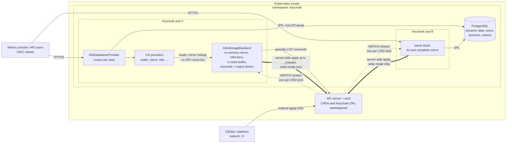

# keycloak-k8store

Keycloak datastore extension that stores Keycloak data as **Kubernetes Custom Resources**.
By default the **configuration entities** (realms, clients, client scopes, roles, groups,
identity providers) live in CRs while dynamic data (users, sessions) stays in the database —
ideal for GitOps: your platform writes `KeycloakRealm`/`KeycloakClient` manifests, Keycloak
serves them read-only. Optionally, **every** storage area can be CR-backed.

Requires **Keycloak nightly** with the `stateless` feature. See [ARCHITECTURE.md](ARCHITECTURE.md)
for the design and the full details behind everything below.

```yaml
apiVersion: k8store.dominikschlosser.github.io/v1alpha1
kind: KeycloakClient          # kubectl get kc
metadata:
  name: my-realm.my-app
spec:
  realm: my-realm
  clientId: my-app
  enabled: true
  redirectUris: ["https://my-app.example.com/*"]
```

CRs use Keycloak's own representation JSON as their spec. Changes applied with `kubectl`/GitOps
are served by every Keycloak node within milliseconds — no restarts, no cache invalidation.

## How it fits together



Every pod keeps its own watch-synchronized in-memory mirror of the CRs, so reads never hit the
API server and pods need no coordination — sequence diagrams and the full design are in
[ARCHITECTURE.md](ARCHITECTURE.md#how-it-works--at-a-glance).

## Quickstart (local)

```bash
scripts/kind-up.sh      # 2-worker kind cluster + local registry (needed by the tests too)
mvn install             # build + unit and integration tests
scripts/deploy.sh       # CRDs + postgres + 2 Keycloak replicas (admin/admin), write mode
scripts/deploy.sh --read-only true    # flip to the GitOps production pattern
kubectl -n keycloak get keycloakrealms,keycloakclients
scripts/kind-down.sh
```

Write mode materializes everything an admin does as CRs (useful for bootstrapping: click it
together in the console, then `kubectl get ... -o yaml` becomes your GitOps source). Read-only
mode rejects all config writes through Keycloak — the CRs are the single source of truth.

## Deploying elsewhere

Build `core/target/providers/` (`mvn -pl core -DskipTests package`) and copy all its jars into
Keycloak's `providers/` directory (see `deploy/Dockerfile`), apply `crds/`, and give the
Keycloak service account `get,list,watch` (plus write verbs in write mode) on the
`k8store.dominikschlosser.github.io` API group (see `deploy/20-rbac.yaml`).

## Configuration

Build options (`kc.sh build`, see `deploy/Dockerfile`):

```
--features=stateless                             # required (nightly)
--spi-datastore--provider=k8store
--spi-realm--jpa--enabled=false
--spi-realm-cache--default--enabled=false        # the CR mirror replaces the realm cache
--spi-authorization-cache--default--enabled=false     # when using the authorization area
--spi-organization--infinispan--enabled=false         # when using the organization area
```

Datastore options (`--spi-datastore--k8store--<option>`, or env
`KC_SPI_DATASTORE__K8STORE__<OPTION>`):

| Option | Default | Purpose |
|---|---|---|
| `read-only` | `true` | Reject config writes; CRs are managed out-of-band |
| `areas` | `config` | `config`, `all`, or a comma list (see below) |
| `namespace` | pod namespace | Namespace to watch |
| `all-namespaces` | `false` | Watch cluster-wide |
| `context` | in-cluster | Kubeconfig context override (used by the tests) |
| `sync-timeout-seconds` | `120` | Max informer sync wait at boot |
| `reconcile-interval-seconds` | `60` | Staleness bound if a watch wedges (`0` = off) |
| `expiration-sweep-seconds` | `300` | Reaper for expired session/dynamic CRs |

### Areas

`areas` selects what is CR-backed; everything else falls through to Keycloak's default storage.

- **`config`** (default, the supported production pattern): `realm, client, client-scope,
  role, group, identity-provider`.
- **Opt-in config areas**: `authorization` (Authorization Services; requires `client`),
  `organization` (requires `group,identity-provider`; also disable the organization Infinispan
  cache — and the `organization` *feature* must stay disabled unless this area is on).
- **Dynamic areas** (always writable, even in read-only mode): `user-session, auth-session,
  login-failure, single-use-object, revoked-token, user`.
- **`all`** = everything above.

**The dynamic areas are experimental**: every login becomes CR writes (etcd churn and size
limits apply), and CR writes are transaction-buffered but not atomic with the database. User
CRs contain **credential hashes and broker tokens — lock down RBAC on `keycloakusers`**.

## CRD kinds

20 kinds under `k8store.dominikschlosser.github.io/v1alpha1` (manifests in `crds/`, regenerated by
`scripts/update-crds.sh`). Config: `KeycloakRealm` (kr), `KeycloakClient` (kc),
`KeycloakClientScope` (kcs), `KeycloakRole` (kro), `KeycloakGroup` (kg); authorization:
krs/kazr/kazs/kazp/kpt; organizations: korg/korginv; dynamic: ku/kus/kas/klf/ksuo/krt/kuvc/kivc.
Identity providers are embedded in the realm spec.

On Keycloak version bumps: `scripts/update-crds.sh` regenerates the schemas,
`scripts/crd-tools.sh` classifies the changes (compatible vs breaking) and applies them
server-side without downtime; CRs are stamped with the writing Keycloak version and drift is
warned at boot.

## Known limitations

Keycloak model migrations are a no-op for CR data (check upstream migration notes on version
bumps); fine-grained admin permissions v2 needs write mode; switching an area on existing data
is an unassisted migration event; realm renames don't rewrite child CRs; OID4VC and
parameterized scopes are experimental upstream. Details in [ARCHITECTURE.md](ARCHITECTURE.md).

## License

Apache-2.0 ([LICENSE](LICENSE), [NOTICE](NOTICE)). The datastore-extension pattern was
inspired by [keycloak-extension-filestore](https://github.com/opdt/keycloak-extension-filestore).
