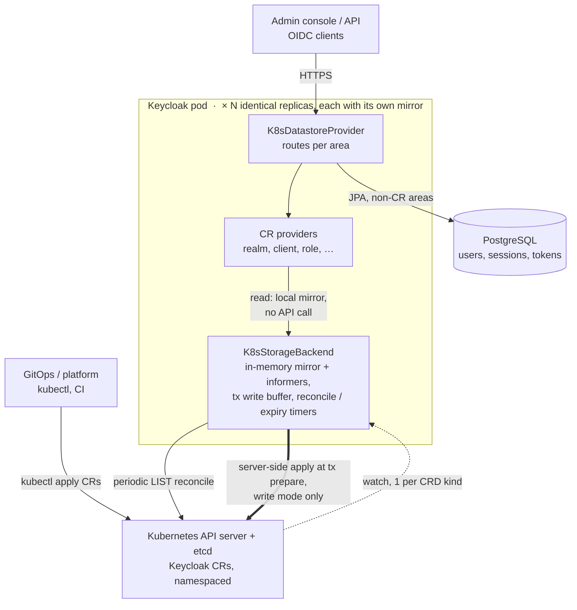

# keycloak-k8store

Keycloak datastore extension that stores Keycloak data as **Kubernetes Custom Resources**.
By default the **configuration entities** (realms, clients, client scopes, roles, groups,
identity providers) live in CRs while dynamic data (users, sessions) stays in the database -
ideal for GitOps: your platform writes `KeycloakRealm`/`KeycloakClient` manifests, Keycloak
serves them read-only. Optionally, **every** storage area can be CR-backed.

Requires **Keycloak 26.7.0+** with the `stateless` feature. See [ARCHITECTURE.md](ARCHITECTURE.md)
for the design and the full details behind everything below.

```yaml
apiVersion: k8store.dominikschlosser.github.io/v1alpha1
kind: KeycloakClient          # kubectl get kc
metadata:
  name: my-realm.my-app
spec:
  realm: my-realm
  clientId: my-app
  protocol: openid-connect
  enabled: true
  standardFlowEnabled: true
  redirectUris: ["https://my-app.example.com/*"]
```

CRs use Keycloak's own representation JSON as their spec. Changes applied with `kubectl`/GitOps
are served by every Keycloak node within milliseconds. No restarts. No cache invalidation.

The spec is served **verbatim**. A field you omit is not backfilled with the default the admin
console would apply. An unset boolean reads as `false`. An unset string reads as `null`. Set the
fields your entity actually needs, as the client above sets `protocol` and `standardFlowEnabled`.
To get a complete manifest, create the entity once in [write mode](#quickstart-local) and export
the CR Keycloak materializes. It has every default filled in.

## Architecture



Every pod keeps its own watch-synchronized in-memory mirror of the CRs, so reads never hit the
API server and pods need no coordination - sequence diagrams and the full design are in
[ARCHITECTURE.md](ARCHITECTURE.md#how-it-works--at-a-glance).

## Quickstart (local)

```bash
scripts/kind-up.sh      # 2-worker kind cluster + local registry (needed by the tests too)
mvn install             # build + unit and integration tests
scripts/deploy.sh       # CRDs + postgres + 2 Keycloak replicas (admin/admin), write mode
kubectl -n keycloak port-forward svc/keycloak 8080:8080   # then open http://localhost:8080 (admin/admin)
kubectl -n keycloak get keycloakrealms,keycloakclients    # the master realm Keycloak just materialized
scripts/kind-down.sh
```

To reach the deployed Keycloak on the host without the port-forward, recreate the cluster with
`KIND_PUBLISH_KEYCLOAK_PORTS=1 scripts/kind-up.sh` - that publishes the Service NodePorts so
`http://localhost:8080` (console) and `http://localhost:9000` (health/metrics) hit it directly.
It is opt-in because binding those host ports collides with the integration test server, so don't
combine it with `mvn install` in the same run.

Write mode materializes everything an admin does as CRs (useful for bootstrapping: click it
together in the console, then `kubectl get ... -o yaml` becomes your GitOps source). Read-only
mode (`scripts/deploy.sh --read-only true`) rejects all config writes through Keycloak - the CRs
become the single source of truth, which is the GitOps production pattern. Flip a local playground
to it only once you have CR manifests to serve; on a fresh cluster it just leaves you with the
bootstrapped master realm and no way to add more through the console.

`scripts/benchmark.sh` runs a k8store-vs-vanilla load-test comparison against this cluster
using Keycloak's official keycloak-benchmark tool; results in [docs/BENCHMARK.md](docs/BENCHMARK.md).

## Deploying elsewhere

Build `core/target/providers/` (`mvn -pl core -DskipTests package`) and copy all its jars into
Keycloak's `providers/` directory (see `deploy/Dockerfile`), apply `crds/`, and give the
Keycloak service account `get,list,watch` (plus write verbs in write mode) on the
`k8store.dominikschlosser.github.io` API group (see `deploy/20-rbac.yaml`).

## Configuration

Build options (`kc.sh build`, see `deploy/Dockerfile`):

```
--features=stateless                             # required
--spi-datastore--provider=k8store                # required — opts into k8store
```

That's all. Selecting the k8store datastore opts in. From there k8store disables the SPI providers
that would otherwise shadow the CR-backed stores. Those are the built-in JPA realm provider and the
realm, authorization, and organization infinispan caches. The CR informer mirror is the cache. The
infinispan caches never observe out-of-band CR edits. k8store contributes those disables as config
**defaults** from a `ConfigSourceFactory` (`K8sConfigDefaultsSourceFactory`), honored at both
`kc.sh build` and a re-augmenting `start`. You never set them by hand. Any explicit `--spi-*` still
wins. The self-configuration only activates when k8store is the selected datastore.

Datastore options (`--spi-datastore--k8store--<option>`, or env
`KC_SPI_DATASTORE__K8STORE__<OPTION>`):

| Option | Default | Purpose |
|---|---|---|
| `read-only` | `true` | Reject config writes; CRs are managed out-of-band |
| `areas` | `config` | `config`, `all`, or a comma list (see below) |
| `namespace` | pod namespace | Namespace to watch |
| `all-namespaces` | `false` | Watch cluster-wide |
| `sync-timeout-seconds` | `120` | Max informer sync wait at boot |
| `reconcile-interval-seconds` | `60` | Upper bound on staleness if a watch connection silently stops delivering events (`0` = off) |
| `expiration-sweep-seconds` | `300` | Reaper for expired session/dynamic CRs |
| `resolve-references` | `false` | Resolve `valuesFrom` Secret/ConfigMap/literal references in CR values on read (see below) |
| `validate-references` | `false` | Validate every `valuesFrom` reference at boot and fail startup on any problem (needs `resolve-references`) |

### Areas

`areas` selects what is CR-backed; everything else falls through to Keycloak's default storage.

- **`config`** (default, the supported production pattern): `realm, client, client-scope,
  role, group, identity-provider`.
- **Opt-in config areas**: `authorization` (Authorization Services) and `organization`
  (Keycloak Organizations; also disable the organization Infinispan cache, and the
  `organization` *feature* must stay disabled unless this area is on).
- **Dynamic areas** (always writable, even in read-only mode): `user-session, auth-session,
  login-failure, single-use-object, revoked-token, user`.
- **`all`** = everything above.

An area whose data lives inside another area's CR pulls its prerequisites in automatically, so
you never have to list them by hand: `authorization` adds `client`; `organization` adds `group`,
`identity-provider` and (through the latter) `realm`. So `areas=organization` is enough.

**The dynamic areas are experimental**: every login becomes CR writes (etcd churn and size
limits apply), and CR writes are transaction-buffered but not atomic with the database. User
CRs contain **credential hashes and broker tokens - lock down RBAC on `keycloakusers`**.

### Secret, ConfigMap and literal references

Some CR values are secrets - a client `secret`, the realm `smtpServer` password, an identity
provider `clientSecret`, an LDAP `bindCredential`. With `resolve-references=true` these can live in
a Kubernetes `Secret` or `ConfigMap` and be referenced from the CR, so the manifest you commit to
git only holds a reference. References are resolved on read; the CR itself is served verbatim, so
the resolved value never lands back in the stored CR.

A config CR declares its references in a `valuesFrom` list, the same shape the Grafana operator
uses. Each entry names a `targetPath` (the string it feeds) and a `valueFrom` source. The value is
injected where a `${...}` placeholder sits in the string at that path. A `${...}` that no entry
points at is left untouched, so Keycloak's own `${...}` tokens (localization keys, policy
expressions) stay intact. A `valueFrom` is one of:

- `secretKeyRef: {name, key}` - key `key` of the `Secret` `name`
- `configMapKeyRef: {name, key}` - key `key` of the `ConfigMap` `name`
- `value` - an inline literal

The placeholder that a Secret/ConfigMap value replaces is the referenced `key`, so `${my-app}`
pairs with `key: my-app`. A literal replaces the single `${...}` at its `targetPath`. `targetPath`
uses dot notation with array indexing (`redirectUris[0]`, `identityProviders[0].config.clientSecret`);
map keys that contain dots use brackets (`components[org.keycloak.storage.UserStorageProvider][0]`).

```yaml
apiVersion: k8store.dominikschlosser.github.io/v1alpha1
kind: KeycloakClient
metadata:
  name: master.my-app
spec:
  realm: master
  clientId: my-app
  secret: ${my-app}
  valuesFrom:
    - targetPath: secret
      valueFrom:
        secretKeyRef:
          name: kc-client-secrets
          key: my-app
```

Runnable examples that a test exercises on every build live in [`examples/references`](examples/references).

Referenced Secrets and ConfigMaps must live in the datastore's own namespace (a reference carries
no namespace), and the service account needs `get,list,watch` on `secrets` and `configmaps` (already
in `deploy/20-rbac.yaml`, commented as such). A reference that cannot be resolved (missing
Secret/ConfigMap/key, a `targetPath` that does not point at a matching placeholder) is left in place
verbatim and logged - it fails open, visibly.

Set `validate-references=true` to check every reference once at boot instead, after the Secret and
ConfigMap caches have synced. The boot then fails with a report of every offending CR rather than
serving unresolved placeholders. It needs `resolve-references`.

References are resolved only in the config kinds (realm, client, ...); the always-writable runtime
kinds (users, sessions, ...) are Keycloak-owned data and are served verbatim.

`resolve-references` **requires `read-only` mode** (the default) and the boot fails otherwise.
Resolution happens on read, and the admin console reads through the same path, so it sees the
resolved value; in write mode a save would map the whole representation back and persist that
resolved value into the CR in clear, overwriting the reference. Read-only mode forbids config
writes, so references stay intact.

## CRD kinds

20 kinds under `k8store.dominikschlosser.github.io/v1alpha1` (manifests in `crds/`, regenerated by
`scripts/update-crds.sh`). Identity providers are embedded in the realm spec. On Keycloak version
bumps the CRDs regenerate and apply without downtime - see below.

| Area | Kinds (short name) |
|---|---|
| Config | `KeycloakRealm` (kr), `KeycloakClient` (kc), `KeycloakClientScope` (kcs), `KeycloakRole` (kro), `KeycloakGroup` (kg) |
| Authorization | `KeycloakResourceServer` (krs), `KeycloakAuthzResource` (kazr), `KeycloakAuthzScope` (kazs), `KeycloakAuthzPolicy` (kazp), `KeycloakPermissionTicket` (kpt) |
| Organizations | `KeycloakOrganization` (korg), `KeycloakOrganizationInvitation` (korginv) |
| Dynamic | `KeycloakUser` (ku), `KeycloakUserSession` (kus), `KeycloakAuthSession` (kas), `KeycloakLoginFailure` (klf), `KeycloakSingleUseObject` (ksuo), `KeycloakRevokedToken` (krt), `KeycloakUserVerifiableCredential` (kuvc), `KeycloakIssuedVerifiableCredential` (kivc) |

## Keycloak version upgrades

Two things happen on a Keycloak version bump, and only one of them is automatic:

- **Schema**: `scripts/update-crds.sh` regenerates the CRD schemas from the new Keycloak;
  `scripts/crd-tools.sh` classifies the changes and applies them without downtime. Database
  (Liquibase) migrations for DB-stored data run normally.
- **Content**: Keycloak's built-in *model migrations* - boot-time rewrites of stored config,
  e.g. "add the new built-in `basic` client scope to every realm" (Keycloak 25) - are
  **deliberately skipped for CR data**. In a GitOps store, a hidden boot-time write would fight
  your manifests (the next `kubectl apply` reverts it) and read-only mode forbids it anyway.
  So on upgrades: read the upstream migration guide, and if a config-level change applies,
  express it in your CR manifests yourself. A practical shortcut: bootstrap the new version in
  write mode against a scratch namespace and diff its CRs against yours. Every CR is stamped
  with the Keycloak version that wrote it, and the server warns at boot about CRs stamped by an
  older version - that's your prompt to check the notes.

## Known limitations

- Fine-grained admin permissions v2 needs write mode.
- Switching an area on existing data is an unassisted migration event.
- Realm renames don't rewrite child CRs.
- Areas can't be split from their prerequisites: an area whose data lives in another area's CR
  forces that area onto CRs too (`organization` pulls in `group`, `identity-provider`, `realm`;
  `authorization` pulls in `client`). So you can't, e.g., serve organizations from CRs while
  keeping groups in the database.
- OID4VC and parameterized scopes are experimental upstream.

Details in [ARCHITECTURE.md](ARCHITECTURE.md).

## License

Apache-2.0 ([LICENSE](LICENSE)
